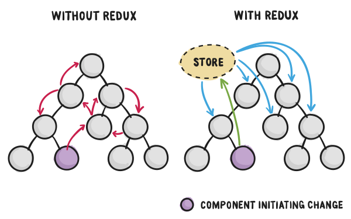

> 前言：
> - 主要参考[《從零開始學 ReactJS》](https://github.com/carlleton/reactjs101/tree/zh-CN)的顺序边学边练习的方式推进
> - 其中demos参考自 *阮一峰* 的[《全栈工程师培训材料-demos》](https://github.com/ruanyf/jstraining/tree/master/demos)中的react部分

# 参考资料
- [中文文档](http://www.css88.com/react/docs/hello-world.html)
- [【译】Redux + React 应用程序架构的 3 条规范（内附实例）](https://blog.jimmylv.info/2016-07-04-rules-for-structuring-redux-applications/)
- [從零開始學 ReactJS](https://github.com/carlleton/reactjs101/tree/zh-CN)
- [React学习资源汇总](https://github.com/tsrot/study-notes/blob/master/React%E5%AD%A6%E4%B9%A0%E8%B5%84%E6%BA%90%E6%B1%87%E6%80%BB.md)
- [react-boilerplate](https://github.com/mxstbr/react-boilerplate/tree/master/docs)
- [React 测试入门教程](http://www.ruanyifeng.com/blog/2016/02/react-testing-tutorial.html)
- [React 生态/学习资料](http://cn.redux.js.org/docs/introduction/Ecosystem.html)
- [Redux 莞式教程](https://github.com/kenberkeley/redux-simple-tutorial)
# 架子库
- [create-react-app](https://github.com/facebookincubator/create-react-app)
- [react-cool-starter](https://github.com/wellyshen/react-cool-starter)

# 开始旅程

## [React 生态系（Ecosystem）入门简介](https://github.com/carlleton/reactjs101/blob/zh-CN/Ch01/react-ecosystem-introduction.md)
> 根据 React 官方网站 的说明：React 是一个专注于 UI（View）的 JavaScript > 
> 函式库（Library）。自从 Facebook 于 2013 年开源 React 
> 这个函式库后，相关的生态系开始蓬勃发展。事实上，透过学习 React 
> 生态系（ecosystem）的过程中，可以让我们顺便学习现代化 Web 开发的重要观念（例
> 如：模组化、ES6+、Webpack、Babel、ESLint、函数式程式设计等），成为更好的开发
> 者。

#### ReactJS
ReactJS 是 Facebook 推出的 JavaScript 函式库，若以 MVC 框架来看，React 定位是在 View 的范畴。在 ReactJS 0.14 版之后，ReactJS 更把原先处理 DOM 的部分独立出去（react-dom），让 ReactJS 核心更单纯，也更符合 React 所倡导的 Learn once, write everywhere 的理念。事实上，ReactJS 本身的 API 相对单纯，但由于整个生态系非常庞大，因此学习 React 却是一条漫长的道路。此外，当你想把 React 应用在你的应用程式时，你通常必须学习整个 React Stack 才能充分发挥 React 的最大优势。

#### JSX
事实上，JSX 并非一种全新的语言，而是一种语法糖（Syntatic Sugar），一种语法类似 XML 的 ECMAScript 语法扩充。

#### NPM

#### ES6+
ES6+ 系指 ES6（ES2015）和 ES7 的联集，在 ES6+ 新的标准当中引入许多新的特性和功能，弥补了过去 JavaScript 被诟病的一些特性。由于未来 React 将以支援 ES6+ 为主，因此直接学习 ES6+ 用法是相对好的选择，本书的所有范例也将会以 ES6+ 撰写。

#### Babel
由于并非所有浏览器都支援 ES6+ 语法，所以透过 Babel 这个 JavaScript 编译器（可以想成是翻译机或是翻译蒟篛）可以让你的 ES6+ 、JSX 等程式码转换成浏览器可以看的懂得语法。通常会在资料夹的 root 位置加入 .bablerc 进行转译规则 preset 和引用外挂（plugin）的设定。

#### JavaScript 模组化开发
随着 Web 应用程式的复杂性提高，JavaScript 模组化开发已经成为必然的趋势，以下简单介绍 JavaScript 模组化的相关规范。事实上，在一开始没有官方定义的标准时出现了各种社群自行定义的规范和实践。

#### [Webpack Gulp](https://github.com/howardwzh/star-webpack-gulp)

#### ESLint
ESLint 是一个提供 JavaScript 和 JSX 的程式码检查工具，可以确保团队的程式码品质。其支援可插拔的特性，可以根据需求在 .eslintrc 设定检查规则。目前主流的检查规则会使用 Airbnb 所释出的 Airbnb React/JSX Style Guide，在使用上需先安装 eslint-config-airbnb 等套件。

#### React Router
React Router 是 React 中主流使用的 Routing 函式库，透过 URL 的变化来管理对应的状态和组件。若开发不刷页的单页式（single page application）的 React 应用程式通常都会需要用到。

#### Flux/Redux
Flux 是一个实现单项流的应用程式资料架构（architecture），同样是由 Facebook 推出，并和 React 专注于 View 的部份形成互补。而由 Dan Abramov 所开发的 Redux 被 React 开发社群认为是 Flux-like 更优雅的作法，也是目前主流搭配 React 的状态（State）管理工具。让你在开发复杂的应用程式时可以更方便管理你的状态（state）。

#### ImmutableJS
ImmutableJS，是一个能让开发者建立不可变资料结构的函式库。建立不可变（immutable）资料结构不仅可以让状态可预测性更高，也可以提升程式的效能。

#### Isomorphic JavaScript
Isomorphic JavaScript 是指前后端（Client/Server）共用相同部分的程式码，让 JavaScript 应用可以同时执行在浏览器端和伺服器端，在 React 中可以透过伺服器端渲染（server side rendering）静态 HTML 的方式达到 Isomorphic JavaScript 效果，让 SEO 和执行效能更加提升并让前后端共用程式码。而另一个常一起出现的 Universal JavaScript 一般定义更为广泛，系指可以运行在不同环境下的 JavaScript Code，并不局限于浏览器和伺服器端。但要留意的是在 Github 和许多技术文章的分享上会把两者定义为同一件事情。

#### React 测试
Facebook 本身有提供 Test Utilities，但由于不够好用，所以目前主流开发社群比较倾向使用 Airbnb 团队开发的 enzyme，其可以与市面上常见的测试工具（Mocha、Karma、Jest 等）搭配使用。其中 Jest 是 Facebook 所开发的单元测试工具，其主要基于 Jasmine 所建立的测试框架。Jest 除了支援 JSDOM 外，也可以自动模拟 (mock) 透过 require() 进来的模组，让开发者可以更专注在目前被测试的模组中。

#### React Native
React Native和过去的 Apache Cordova 等基于 WebView 的解决方案比较不同，它让开发者可以使用 React 和 JavaScript 开发原生应用程式（Native App），让 Learn once, write anywhere 理想变得可能。

#### GraphQL/Relay
GraphQL 是 Facebook 所开发的资料查询语言（Data Query Language），主要是想解决传统 RESTful API 所遇到的一些问题，并提供前端更有弹性的 API 设计方式。Relay 则是 Facebook 提出搭配 GraphQL 用于 React 的一个宣告式数据框架，可以降低 Ajax 的请求数量（类似的框架还有 Netflix 推出的 Falcor）。但由于目前主流的后端 API 仍以传统 RESTful API 设计为主，所以在使用 GraphQL 上通常会需要比较大架构设计的变动。因此本书则是把 GraphQL/Relay 介绍放到附录的部份，让有兴趣的读者可以自行参考体验一下。

## [React 开发环境设置与 Webpack 入门教学](https://github.com/carlleton/reactjs101/blob/zh-CN/Ch02/webpack-dev-enviroment.md)

#### JavaScript 模组化
**总的来说，使用模组化开发 JavaScript 应用程式主要有以下三种好处：**

1. 提升维护性（Maintainability）
2. 命名空间（Namespacing）
3. 提供可重用性（Reusability）

**以下是 React 官方首页的范例，以下使用 React v15.2.1：**

1. 理解 React 是 Component 导向的应用程式设计
2. 引入 react.js、react-dom.js（react 0.14 后将 react-dom 从 react 核心分离，更符合 react 跨平台抽象化的定位）以及 babel-standalone 版 script（可以想成 babel 是翻译机，翻译浏览器看不懂的 JSX 或 ES6+ 语法成为浏览器看的懂得的 JavaScript。为了提升效率，通常我们都会在伺服器端做转译，这点在 production 环境尤为重要）
3. 在 <body> 撰写 React Component 要插入（mount）指定节点的地方：<div id="example"></div>
4. 透过 babel 进行语言翻译 React JSX 语法，babel 会将其转为浏览器看的懂得 JavaScript。其代表意义是：ReactDOM.render(欲 render 的 Component 或 HTML 元素, 欲插入的位置)。所以我们可以在浏览器上打开我们的 hello.html，就可以看到 Hello, world! 。That's it，我们第一个 React 应用程式就算完成了！

```html
<!DOCTYPE html>
<html>
  <head>
    <meta charset="UTF-8" />
    <title>Hello React!</title>
    <!-- 以下引入 react.js, react-dom.js（react 0.14 后将 react-dom 从 react 核心分离，更符合 react 跨平台抽象化的定位）以及 babel-core browser 版 -->
    <script src="https://cdnjs.cloudflare.com/ajax/libs/react/15.2.1/react.min.js"></script>
    <script src="https://cdnjs.cloudflare.com/ajax/libs/react/15.2.1/react-dom.min.js"></script>
    <script src="https://cdnjs.cloudflare.com/ajax/libs/babel-standalone/6.18.1/babel.min.js"></script>
  </head>
  <body>
    <!-- 这边的 id="example" 的 <div> 为 React Component 要插入的地方 -->
    <div id="example"></div>
    <!-- 以下就是包在 babel（透过进行语言翻译）中的 React JSX 语法，babel 会将其转为浏览器看的懂得 JavaScript -->
    <script type="text/babel">
      ReactDOM.render(
        <h1>Hello, world!</h1>,
        document.getElementById('example')
      );
    </script>
  </body>
</html>
```

#### Webpack
**[Webpack](https://webpack.github.io/) 是一个模组打包工具（module bundler），以下列出 Webpack 的几项主要功能：**

- 将 CSS、图片与其他资源打包
- 打包之前预处理（Less、CoffeeScript、JSX、ES6 等）档案
- 依 entry 文件不同，把 .js 分拆为多个 .js 档案
- 整合丰富的 Loader 可以使用（Webpack 本身仅能处理 JavaScript 模组，其余档案如：CSS、Image 需要载入不同 Loader 进行处理）

## [ReactJS 与 Component 设计入门介绍](https://github.com/carlleton/reactjs101/blob/zh-CN/Ch03/reactjs-introduction.md)

#### ReactJS 特性简介
**ReactJS 的出现让前端开发有许多革新性的思维出现，其中有几个重要特性值得我们去探讨：**

1. 基于组件（Component）化思考

**<TodoApp> 组件可以包含 <TodoHeader />、<TodoList /> 子组件**
```html
<div>
    <TodoHeader />
    <TodoList />
</div>
```

**<TodoList /> 组件内部长相：**
```html
<div>
    <ul>
        <li>写程式码</li>
        <li>哄妹子</li>
        <li>买书</li>
    </ul>
</div>
```

```
//  注意组件开头第一个字母都要大写
class MyComponent extends React.Component {
    // render 是 Class based 组件唯一必须的方法（method）
    render() {
        return (
            <div>Hello, World! </div>
        );
    }
}

// 将 <MyComponent /> 组件插入 id 为 app 的 DOM 元素中
ReactDOM.render(<MyComponent/>, document.getElementById('app'));
```

2. 用 [JSX](https://github.com/carlleton/reactjs101/blob/zh-CN/Ch03/react-jsx-introduction.md) 进行宣告式（Declarative）UI 设计

```javascript
// 使用宣告式（Declarative）UI 设计很容易可以看出这个组件的功能
<MailForm />


// <MailForm /> 内部长相
<form>
    <input type="text" name="email" />
    <button type="submit"></button>
</form>
```

3. 使用 Virtual DOM

在传统 Web 中一般是使用 jQuery 进行 DOM 的直接操作。然而更改 DOM 往往是 Web 效能的瓶颈，因此在 React 世界设计有 Virtual DOM 的机制，让 App 和 DOM 之间用 Virtual DOM 进行沟通。当更改 DOM 时，会透过 React 自身的 diff 演算法去计算出最小更新，进而去最小化更新真实的 DOM。

4. Component PropType 防呆机制

在 React 设计时除了提供 props 预设值设定（Default Prop Values）外，也提供了 Prop 的验证（Validation）机制，让整个 Component 设计更加稳健

```
//  注意组件开头第一个字母都要大写
class MyComponent extends React.Component {
    // render 是 Class based 组件唯一必须的方法（method）
    render() {
        return (
            <div>Hello, World!</div>
        );
    }
}

// PropTypes 验证，若传入的 props type 不符合将会显示错误
MyComponent.propTypes = {
  todo: React.PropTypes.object,
  name: React.PropTypes.string,
  handleClick: React.PropTypes.func
}

// Prop 预设值，若对应 props 没传入值将会使用 default 值
MyComponent.defaultProps = {
 todo: {},
 name: '',
 handleClick: () => { console.log('Hello click!') }
}
```

5. Component 就像个状态机（State Machine），而且也有生命周期（Life Cycle） 

Component 就像个状态机（State Machine），根据不同的 state（透过 setState() 修改）和 props（由父元素传入），Component 会出现对应的显示结果。而人有生老病死，组件也有生命周期。透过操作生命周期处理函数，可以在对应的时间点进行 Component 需要的处理

6. 一律重绘（Always Redraw）和单向资料流（Unidirectional Data Flow）

在 React 世界中，props 和 state 是影响 React Component 长相的重要要素。其中 props 都是由父元素所传进来，不能更改，若要更改 props 则必须由父元素进行更改。而 state 则是根据使用者互动而产生的不同状态，主要是透过 setState() 方法进行修改。当 React 发现 props 或是 state 更新时，就会重绘整个 UI。当然你也可以使用 forceUpdate() 去强迫重绘 Component。而 React 透过整合 Flux 或 Flux-like（例如：Redux）可以更具体实现单向资料流（Unidirectional Data Flow），让资料流的管理更为清晰。

7. 在 JavaScript 里写 CSS：Inline Style

**在 React Component 中 CSS 使用 Inline Style 写法，全都封装在 JavaScript 当中：**

```
const divStyle = {
  color: 'red',
  backgroundImage: 'url(' + imgUrl + ')',
};

ReactDOM.render(<div style={divStyle}>Hello World!</div>, document.getElementById('app'));
```


## [组件生命周期](https://github.com/carlleton/reactjs101/blob/zh-CN/Ch04/react-component-life-cycle.md#react-component-生命周期)

### 组件的生命周期分成三个状态
- Mounting：已插入真实 DOM
- Updating：正在被重新渲染
- Unmounting：已移出真实 DOM

### React 为每个状态都提供了两种处理函数，will 函数在进入状态之前调用，did 函数在进入状态之后调用
- componentWillMount()
- componentDidMount()
- componentWillUpdate(object nextProps, object nextState)
- componentDidUpdate(object prevProps, object prevState)
- componentWillUnmount()

### 此外，React 还提供两种特殊状态的处理函数。
- componentWillReceiveProps(object nextProps)：已加载组件收到新的参数时调用
- shouldComponentUpdate(object nextProps, object nextState)：组件判断是否重新渲染时调用

## [React Router 入门实战教学](https://github.com/carlleton/reactjs101/blob/zh-CN/Ch05/react-router-introduction.md)

#### 开始 React Routing 之旅
以下是 webpack.config.js 的进入点 **src/index.js**，负责管理 Router 和 render 
组件。这边我们要先详细讨论的是，为了使用 React Router 功能引入了许多 
react-router 内部的组件。

1. Router Router 是放置 Route 的容器，其本身不定义 routing ，真正 routing 规则由 Route 定义。
2. Route Route 负责 URL 和对应的组件关系，可以有多个 Route 规则也可以有嵌套（nested）Routing。像下面的例子就是每个页面都会先载入 App 组件再载入对应 URL 的组件。
3. history Router 中有一个属性 history 的规则，这边使用我们使用 hashHistory，使用 routing 将由 hash（#）变化决定。例如：当使用者拜访 http://www.github.com/ ，实际看到的会是 http://www.github.com/#/ 。下列范例若是拜访了 /about 则会看到 http://localhost:8008/#/about 并载入 App 组件再载入 About 组件。
  + hashHistory 教学范例使用的，会通过 hash 进行对应。好处是简单易用，不用多余设定。
  + browserHistory 适用于伺服器端渲染，但需要设定伺服器端避免处理错误，这部份我们会在后面的章节详细说明。注意的是若是使用 Webpack 开发用伺服器需加上 --history-api-fallback
  `$ webpack-dev-server --inline --content-base . --history-api-fallback`
  + createMemoryHistory 主要用于伺服器渲染，使用上会建立一个存在记忆体的 history 物件，不会修改浏览器的网址位置。
  `const history = createMemoryHistory(location)`
4. path path 是对应 URL 的规则。例如：/repos/torvalds 会对应到 /repos/:name 的位置，并将参数传入 Repos 组件中。由 this.props.params.name 取得参数。顺带一提，若为查询参数 /user?q=torvalds 则由 this.props.location.query.q 取得参数。
5. IndexRoute 由于 / 情况下 App 组件对应的 this.props.children 会是 undefinded，所以使用 IndexRoute 来解决对应问题。这样当 URL 为 / 时将会对应到 Home 组件。不过要注意的是 IndexRoute 没有 path 属性。

```
import React from 'react';
import ReactDOM from 'react-dom';
import { Router, Route, hashHistory, IndexRoute } from 'react-router';
import App from './components/App';
import Home from './components/Home';
import Repos from './components/Repos';
import About from './components/About';
import User from './components/User';
import Contacts from './components/Contacts';

ReactDOM.render(
  <Router history={hashHistory}>
    <Route path="/" component={App}>
      <IndexRoute component={Home} />
      <Route path="/repos/:name" component={Repos} />
      <Route path="/about" component={About} />
      <Route path="/user" component={User} />
      <Route path="/contacts" component={Contacts} />
    </Route>
  </Router>,
  document.getElementById('app'));

  /* 另外一种写法：
    const routes = (
        <Route path="/" component={App}>
          <IndexRoute component={Home} />
          <Route path="/repos/:name" component={Repos} />
          <Route path="/about" component={About} />
          <Route path="/user" component={User} />
          <Route path="/contacts" component={Contacts} />
        </Route>
    );

    ReactDOM.render(
      <Router routes={routes} history={hashHistory} />,
      document.getElementById('app'));
  */
```

**以下是 src/components/App/App.js 完整程式码：**

```
import React from 'react';
import { Link, IndexLink } from 'react-router';
import styles from './appStyles';
import NavLink from '../NavLink';

const App = (props) => (
  <div>
    <h1>React Router Tutorial</h1>
    <ul>
      <li><IndexLink to="/" activeClassName="active">Home</IndexLink></li>
      <li><Link to="/about" activeStyle={{ color: 'green' }}>About</Link></li>
      <li><Link to="/repos/react-router" activeStyle={styles.active}>Repos</Link></li>
      <li><Link to="/user" activeClassName="active">User</Link></li>
      <li><NavLink to="/contacts">Contacts</NavLink></li>
    </ul>
    <!-- 我们将 App 组件当做每个组件都会载入的母模版，因此可以透过 children 载入对应 URL 的子组件 -->
    {props.children}
  </div>
);

App.propTypes = {
  children: React.PropTypes.object,
};

export default App;
```

**以下是 src/components/Repos/Repos.js 完整程式码：**

```
import React from 'react';

const Repos = (props) => (
  <div>
    <h3>Repos</h3>
    <h5>{props.params.name}</h5>
  </div>
);

Repos.propTypes = {
  params: React.PropTypes.object,
};

export default Repos;
```


## [ImmutableJS](https://github.com/carlleton/reactjs101/blob/zh-CN/Ch06/react-immutable-introduction.md)
**当 map1 值一改，map2 的值也会受影响。**

```js
var map1 = { a: 1 }; 
var map2 = map1; 
map2.a = 2
```

通常一般作法是使用 deepCopy 来避免修改，但这样作法会产生较多的资源浪费。为了很好的解决这个问题，我们可以使用 Immutable Data，**所谓的 Immutable Data 就是一旦建立，就不能再被修改的数据资料。**

```js
import Immutable from 'immutable';

var map1 = Immutable.Map({ a: 1, b: 3 });
var map2 = map1.set('a', 2);

map1.get('a'); // 1
map2.get('a'); // 2
```

#### ImmutableJS 特性介绍
ImmutableJS 提供了 7 种不可修改的资料类型：List、Map、Stack、OrderedMap、Set、OrderedSet、Record。若是对 Immutable 物件操作都会回传一个新值。其中比较常用的有 List、Map 和 Set：

1. Map：类似于 key/value 的 object，在 ES6 也有原生 Map 对应
```js
const Map= Immutable.Map;

// 1. Map 大小
const map1 = Map({ a: 1 });
map1.size
// => 1

// 2. 新增或取代 Map 元素
// set(key: K, value: V)
const map2 = map1.set('a', 7);
// => Map { "a": 7 }

// 3. 删除元素
// delete(key: K)
const map3 = map1.delete('a');
// => Map {}

// 4. 清除 Map 内容
const map4 = map1.clear();
// => Map {}

// 5. 更新 Map 元素
// update(updater: (value: Map<K, V>) => Map<K, V>)
// update(key: K, updater: (value: V) => V)
// update(key: K, notSetValue: V, updater: (value: V) => V)
const map5 = map1.update('a', () => (7))
// => Map { "a": 7 }

// 6. 合并 Map 
const map6 = Map({ b: 3 });
map1.merge(map6);
// => Map { "a": 1, "b": 3 }
```

[查看更多](https://github.com/carlleton/reactjs101/blob/zh-CN/Ch06/react-immutable-introduction.md#immutablejs-特性介绍)

#### [ImmutableJS 的特性整理](https://github.com/carlleton/reactjs101/blob/zh-CN/Ch06/react-immutable-introduction.md#immutablejs-的特性整理)

#### [React 效能优化](https://github.com/carlleton/reactjs101/blob/zh-CN/Ch06/react-immutable-introduction.md#react-效能优化)
ImmutableJS 除了可以和 Flux/Redux 整合外，也可以用于基本 react 效能优化。以下是一般使用效能优化的简单方式：

传统 JavaScript 比较方式，若资料型态为 Primitive 就不会有问题：

```js
// 在 shouldComponentUpdate 比较接下来的 props 是否一致，若相同则不重新渲染，提升效能
shouldComponentUpdate (nextProps) {
    return this.props.value !== nextProps.value;
}
```

但当比较的是物件的话就会出现问题：

```js
// 假设 this.props.value 为 { foo: 'app' }
// 假设 nextProps.value 为 { foo: 'app' },
// 虽然两者值是一样，但由于 reference 位置不同，所以视为不同。但由于值一样应该要避免重复渲染
this.props.value !== nextProps.value; // true
```

使用 ImmutableJS：

```js
var SomeRecord = Immutable.Record({ foo: null });
var x = new SomeRecord({ foo: 'app'  });
var y = x.set('foo', 'azz');
x === y; // false
```

在 ES6 中可以使用官方文件上的 **PureRenderMixin** 进行比较，可以让程式码更简洁：

```
import PureRenderMixin from 'react-addons-pure-render-mixin';
class FooComponent extends React.Component {
  constructor(props) {
    super(props);
    this.shouldComponentUpdate = PureRenderMixin.shouldComponentUpdate.bind(this);
  }
  render() {
    return <div className={this.props.className}>foo</div>;
  }
}
```

## [Redux 基础概念](https://github.com/carlleton/reactjs101/blob/zh-CN/Ch07/react-redux-introduction.md)

## [Redux 实战入门](https://github.com/carlleton/reactjs101/blob/zh-CN/Ch07/react-redux-real-world-example.md)
以下这张图表示了整个 React Redux App 的资料流程图（使用者与 View 互动 => dispatch 出 Action => Reducers 依据 action tyoe 分配到对应处理方式，回传新的 state => 透过 React Redux 传送给 React，React 重新绘制 View）：


我们先说明整合 react-redux 的用法。从以下这张图可以看到 react-redux 是 React 和 Redux 间的桥梁，使用 Provider、connect 去连结 store 和 React View。


事实上，整合了 react-redux 后，我们的 React App 就可以解决传统跨 Component 之前传递 state 的问题和困难。只要透过 Provider 就可以让每个 React App 中的 Component 取用 store 中的 state，非常方便（接下来我们也会更详细说明 Container/Component、connect 的用法）。



```html
<!DOCTYPE html>
<html lang="en">
<head>
    <meta charset="UTF-8">
    <title>Redux Todo</title>
</head>
<body>
    <div id="app"></div>
</body>
</html>
```

#### src/index.js 完整程式码
```
import React from 'react';
import ReactDOM from 'react-dom';
import { Provider } from 'react-redux';
import Main from './components/Main';
import store from './store';

ReactDOM.render(
  <Provider store={store}>
    <Main />
  </Provider>,
  document.getElementById('app')
);
```

#### src/components/Main/Main.js 是 Stateless Component，负责所有 View 的进入点

```
import React from 'react';
import ReactDOM from 'react-dom';
import TodoHeaderContainer from '../../containers/TodoHeaderContainer';
import TodoListContainer from '../../containers/TodoListContainer';

const Main = () => (
  <div>
    <TodoHeaderContainer />
    <TodoListContainer />
  </div>
);

export default Main;
```

[查看更多](https://github.com/carlleton/reactjs101/blob/zh-CN/Ch07/react-redux-real-world-example.md)

## [Container 与 Presentational Components 入门](https://github.com/carlleton/reactjs101/blob/zh-CN/Ch08/container-presentational-component-.md)
> 以下先参考 Redux 官网 列出两者相异之处：
> 
> Presentational Components
> 
> - 用途：怎么看事情（Markup、外观）
> - 是否让 Redux 意识到：否
> - 取得资料方式：从 props 取得
> - 改变资料方式：从 props 去呼叫 callback function
> - 写入方式：手动处理 
>
> Container Components 
> - 用途：怎么做事情（撷取资料，更新 State）
> - 是否让 Redux 意识到：是
> - 取得资料方式：订阅 Redux State（store）
> - 改变资料方式：Dispatch Redux Action
> - 写入方式：从 React Redux 产生
> 
> 从上面的分析读者可以发现，两者最大的差别在于 Component 主要负责单纯的 UI 
> 的渲染，而 Container 则负责和 Redux 的 store 沟通，作为 Redux 和 Component 之
> 的桥梁。这样的分法可以让程式架构和职责更清楚，所以接下来我们就使用上一章节的 
> Redux TodoApp 进行改造，改造成 Container 与 Presentational Components 模式。

#### Container Components - TodoHeaderContainer.js
```javascript
import { connect } from 'react-redux';
import TodoHeader from '../../components/TodoHeader';

// 将欲使用的 actions 引入
import {
  changeText,
  createTodo,
} from '../../actions';

const mapStateToProps = (state) => ({
  // 从 store 取得 todo state
  todo: state.getIn(['todo', 'todo'])
});

const mapDispatchToProps = (dispatch) => ({
  // 当使用者在 input 输入资料值即会触发这个函数，发出 changeText action 并附上使用者输入内容 event.target.value
  onChangeText: (event) => (
    dispatch(changeText({ text: event.target.value }))
  ),
  // 当使用者按下送出时，发出 createTodo action 并清空 input 
  onCreateTodo: () => {
    dispatch(createTodo());
    dispatch(changeText({ text: '' }));
  }
});

export default connect(
  mapStateToProps,
  mapDispatchToProps,
)(TodoHeader);
```

#### Presentational Components - TodoHeader.js
```javascript
import React from 'react';
import ReactDOM from 'react-dom';

// 开始建设 Component 并使用 connect 进来的 props 并绑定事件（onChange、onClick）。
// 注意我们的 state 因为是使用 `ImmutableJS` 所以要用 `get()` 取值

const TodoHeader = ({
  onChangeText,
  onCreateTodo,
  todo,
}) => (
  <div>
    <h1>TodoHeader</h1>
    <input type="text" value={todo.get('text')} onChange={onChangeText} />
    <button onClick={onCreateTodo}>送出</button>
  </div>
);

export default TodoHeader;
```

#### Container Components - TodoListContainer.js
```js
import { connect } from 'react-redux';
import TodoList from '../../components/TodoList';

import {
  deleteTodo,
} from '../../actions';

const mapStateToProps = (state) => ({
  todos: state.getIn(['todo', 'todos'])
});

// 由 Component 传进欲删除元素的 index
const mapDispatchToProps = (dispatch) => ({
  onDeleteTodo: (index) => () => (
    dispatch(deleteTodo({ index }))
  )
});

export default connect(
    mapStateToProps,
    mapDispatchToProps,
)(TodoList);
```

#### Presentational Components - TodoList.js
```js
import React from 'react';
import ReactDOM from 'react-dom';

// Component 部分值的注意的是 todos state 是透过 map function 去迭代出元素，由于要让 React JSX 可以渲染并保持传入触发 event state 的 immutable，所以需使用 toJS() 转换 component of array。
// 由 Component 传进欲删除元素的 index

const TodoList = ({
  todos,
  onDeleteTodo,
}) => (
  <div>
    <ul>
    {
      todos.map((todo, index) => (
        <li key={index}>
          {todo.get('text')}
          <button onClick={onDeleteTodo(index)}>X</button>
        </li>
      )).toJS()
    }
    </ul>
  </div>
);

export default TodoList;
```

## 附录
- [React ES5、ES6+ 常见用法对照表](https://github.com/carlleton/reactjs101/tree/zh-CN/Appendix01)
- [代码规范](./1.code-standards.md)
- [React 测试入门教学](https://github.com/carlleton/reactjs101/tree/zh-CN/Appendix03)
- [enzyme](http://airbnb.io/enzyme/docs/api/)
- 一张图读懂 React 技术栈

- 生命周期

